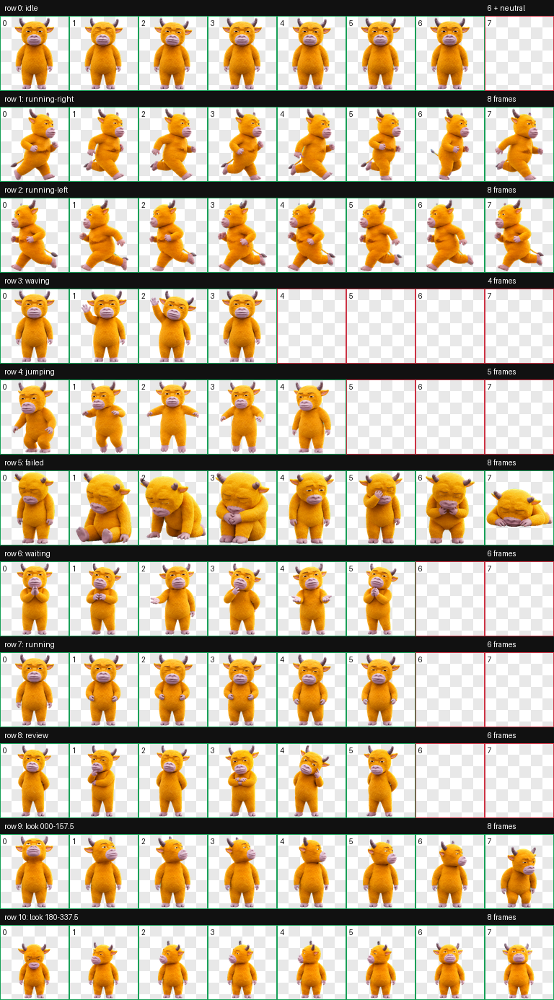
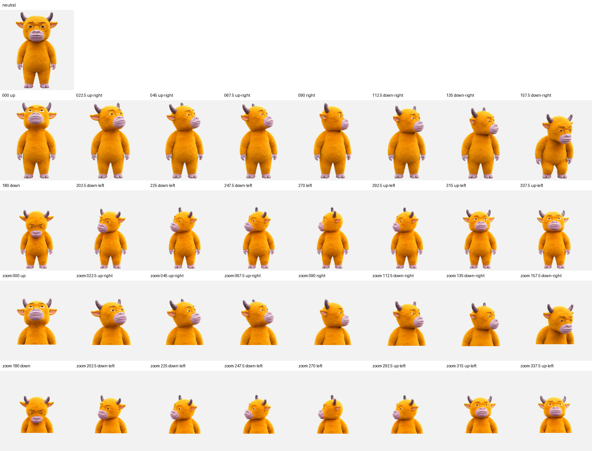

# Niu Lai Codex Pet

《牛来》气质的 Codex 动画桌宠：暖黄色粗糙 CG 小牛、紫灰短角与口鼻、克制的半眯眼表情。

这是一个可以直接克隆和安装的 Git 项目。仓库包含最终透明图集、v2 清单、预览图和无第三方依赖的安装/校验脚本。

## Preview

<p align="center">
  
</p>

<p align="center"><em>9 个标准动画状态与 16 个视线方向的透明图集预览</em></p>

<p align="center">
  
</p>

<p align="center"><em>完整视线方向与 zoom 状态预览</em></p>

## Quick Start

```bash
git clone https://github.com/rcmeng93-cloud/niu-lai-codex-pet.git niu-lai-codex-pet
cd niu-lai-codex-pet
python3 scripts/validate.py
python3 scripts/install.py
```

也可以在 macOS/Linux 上运行：

```bash
./validate.sh
./install.sh
```

安装脚本默认写入 `${CODEX_HOME:-$HOME/.codex}/pets/niu-lai/`。为其它 Codex 安装位置指定路径：

```bash
python3 scripts/install.py --codex-home /path/to/.codex
```

安装完成后重启 Codex 或刷新宠物列表。

## What's Included

- `assets/spritesheet.webp`: 可直接使用的透明 v2 图集。
- `pet.json`: 仓库版清单，指向 `assets/spritesheet.webp`。
- `scripts/install.py`: macOS、Linux、Windows 均可运行的纯 Python 安装器。
- `scripts/validate.py`: 不依赖 Pillow 的图集尺寸、WebP 和 alpha 通道校验器。
- `assets/preview.png`: 9 个标准动画状态与 16 个视线方向的总览。
- `assets/look-directions.png`: 16 个视线方向的标注预览。
- `docs/ATLAS.md`: 行和方向映射。
- `ARTWORK-NOTICE.md`: 角色来源与使用说明。

## Atlas Layout

图集是 `1536x2288`，8 列 × 11 行，每格 `192x208`，`spriteVersionNumber` 为 `2`。完整映射见 [`docs/ATLAS.md`](docs/ATLAS.md)。

## Reuse

要做自己的分发版本，只需要保留 `pet.json`、`assets/spritesheet.webp` 和 `scripts/`，然后修改清单里的名称与描述。安装器会把仓库路径转换成 Codex 本地要求的 `spritesheet.webp` 相对路径。

项目代码和打包脚本采用 MIT 许可证；图像素材请同时阅读 [`ARTWORK-NOTICE.md`](ARTWORK-NOTICE.md)。
